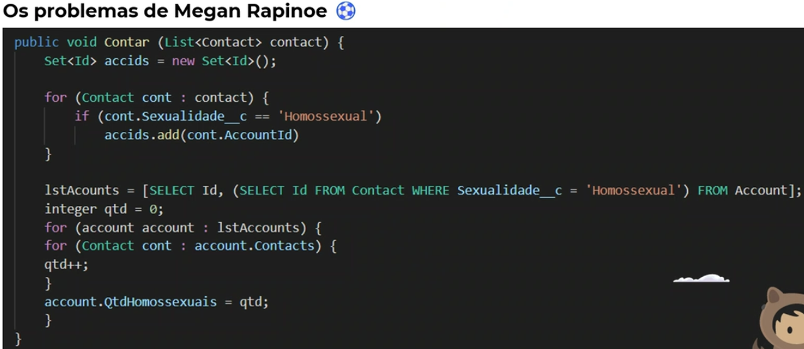

# Org de Estudos para o Best Minds
*Estou juntando todos os desafios propostos nas aulas de Dev nessa org e divindo da seguinte maneira:*
- Do mais recente para o mais antigo
- Cada desafio contém no final o local aonde esta seu arquivo

## Apex Async

### Entregar até terça-feira

- [x] 1 - Criar um campo no objeto Contract, chamado Número de Parcelas do type Number, e criar um método fúturo para atualizar esse campo verificando quantas parcelas aquele contrato possui.

##### [Classe da Atividade](./force-app/main/default/classes/AtualizarContrato.cls)

- [x] 2 - Crie um Batch Apex para atualizar o status do caso para fechado quando ele não conter nenhum contato associado.
##### [Classe da Atividade](./force-app/main/default/classes/SchuduledApex.cls)

- [x] 3 - Criar Scheduled Apex para adicionar um comentário nos casos que estão fechados - “Caso Fechado por ausência de contato”.

##### [Classe da Atividade](./force-app/main/default/classes/SchuduledApex.cls)

## Rever Aula de Hoje - 6 de Maio

---

## Boas Práticas de Programação

### Entregar até terça-feira

- [ ] 1. Serena Williams precisa que toda vez que alterar o domínio de email de uma de suas contas, todos os responsáveis tenham seu e-mail atualizado de acordo com o novo domínio.
> Sejam livres para trazer a melhor solução que atenda ao pedido da Serena Williams colocando em ação as boas práticas de programação
-       Os responsáveis da Conta são os Contatos
-       A Serena Williams são donos dessas contas ( Owner Id)
-       Somente para alterar campo de @dominio.com.br
-       Manter o e-mail e somente alterar domínio
-       Alterar somente quem tiver e-mail, quem não tiver eliminar da Trigger

Passo-a-Passo

- [x]   1. Criar campo de domínio de e-mail
- [x]   2. A Trigger em Account deve executar no After Update ( Passar a Trigger.Old também )
- [x]   3. Trigger valida se o campo criado no item 1 foi alterado ( Validar evento do campo Trigger.Old)
- [x]   4. Armazenar os id de Uma Conta em uma varíavel
- [x]   5. Laço de repetição da Trigger para Adicionar na varíavel do item 4 no Id de Cada Conta
- [ ]   6. Buscar contatos relacionado a conta que tem e-mail
- [ ]   7. Laço de repetição pra atualizar o e-mail de cada contato com o domínio da conta
- [ ]   8. Criar uma varíavel que armazena os contatos
- [ ]   9. Atualiza a DML a varíavel dos contatos

---

- [ ] 2. Megan Rapinoe contratou uma consultoria para desenvolver um código que identificasse a quantidade de jogadoras homossexuais de cada time da National Women's Soccer League, entretanto, o código não está funcionando. Você como desenvolver e consultor Salesforce da Everymind, ajude a Megan a alcançar seu objetivo.

---

- [ ] 3. Agora que o Max Verstappen é o novo campeão da Fórmula 1, ele está mais do que nunca preocupado com o salário dos principais sócios (Contatos) de seus patrocínios. O desejo dele é identificar quais contas tem um faturamente maior que 1 milhão e pegar 50% desse faturamento e distrubuir de forma igualitária para cada sócio da Conta.

---
## Apex Trigger ✅

### Entregar até segunda-feira

#### Refeito todos com as boas práticas caso o Bruno queira somente dentro da Trigger, enviar da pasta no gitIgnore

- [x] 1 - Crie um Apex Trigger que, ao criar um registro de Contrato (Contract), crie um registro de Tarefa (Task), caso a Conta (Account) vinculada não possua um registro de Dados Bancários (DadosBancarios__c):
*     OwnerId = Proprietário da conta vinculado no caso
*     WhatId = Conta vinculada ao caso
*     ActivityDate = Data atual
*     Subject = Necessário cadastrar os dados bancários do cliente

##### [Trigger da Atividade](./force-app/main/default/triggers/TriggerContract.trigger)

---

- [x] 2 - Crie um Apex Trigger que, ao ativar um Contrato (Contract) (Status = Activated), valide se a Conta (Account) vinculada possui um registro de Dados Bancários (DadosBancarios__c) ativo. Caso não possua, exibir uma mensagem que ele não pode ativar um Contrato (Contract) sem ter um registro de Dados Bancários (DadosBancarios__c) ativo. Obs.: Utilizar o método addError.

##### [Trigger da Atividade](./force-app/main/default/triggers/TriggerContract.trigger)

---
- [x] 3 - Crie um Apex Trigger que, ao criar ou atualizar um registro de Caso (Case) com o tipo “Sinistro”, valide se a conta vinculada possui um Contrato (Contract) ativo. Caso não possua, exibir uma mensagem que ele não pode abrir um sinistro sem um Contrato (Contract) ativo. Obs.: Utilizar o método addError.

##### [Trigger da Atividade](./force-app/main/default/triggers/TriggerCase.trigger)

---

- [x] 4 - Crie um Apex Trigger que, ao criar um registro de Dados Bancários (DadosBancarios__c) ativo, inative todos os outros registros de Dados Bancários ativos do cliente, menos o que acabou de ser ativado.

##### [Trigger da Atividade](./force-app/main/default/triggers/TriggerDadosBancarios.trigger)

---

- [x] 5 - Crie um Apex Trigger que, ao criar um registro de oportunidade (Opportunity), verifique se o Contato (Contact) não foi preenchido e se a Conta (Account) vinculada possui apenas 1 Contato (Contact). Caso isso aconteça, vincule automaticamente esse Contato (Contact) na Oportunidade (Opportunity).

##### [Trigger da Atividade](./force-app/main/default/triggers/TriggerOpportunity.trigger)

---

## Conceitos Básicos da Linguagem - EXTRAS

- [ ] 1 - Crie um método que retorne um mapa com os dados bancários por CNPJ de conta.

---

- [ ] 2 - Crie um método que receba uma lista de inteiros e devolva uma lista com os valores pares. Ex.: Use o método Math.mod que retorna o resto de uma divisão.
[Salesforce Help](https://developer.salesforce.com/docs/atlas.en-us.apexref.meta/apexref/apex_methods_system_math.htm#apex_System_Math_mod)

---

- [ ] 3 - Crie um método que faça a comparação dos itens de dois sets e retorne a quantidade de itens que são comuns entre elas.
Parâmetros do método
- set1 (Set<String>)
- set2 (Set<String>)
Retorno do método:
- Um número que indica a quantidade de itens repetidos

---

- [ ] 4 - Crie um método que receba uma lista de inteiro como parâmetro e retorne o maior valor dessa lista.

---

- [ ] 5 - Crie um método que receba uma lista de inteiro e retorne uma outra lista com todos os valores multiplicados por 2

---

## Laços de Repetição ✅

- [x] 1 - Criar um método que insira vários registros de Oportunidade.
> Este método deve receber um valor inteiro que representará a quantidade de Oportunidade a serem criadas
>>        1. Paramêtros:
            a. Id do Cliente (Id)
            b. Id do Contato (Id)
            c. Número de Oportunidades (Integer)
            d. Valor das Oportunidades (Decimal)
>>        2. Regras:
            a. O Nome da Oportunidade deve ser o número da Oportunidade que está sendo criada + nome da Conta,
            por exemplo: 1 - Conta Teste, 2 - Conta Teste...

##### [Classe da Atividade](./force-app/main/default/classes/OpportunityBO.cls#L73)

---
- [x] 2 - Criar um método que receba uma lista de Oportunidades e retorna a quantidade de oportunidades que possui o valor maior que R$10.000,00 ( Refatorei para filtrar o valor da Oportunidade como quiser )

##### [Classe da Atividade](./force-app/main/default/classes/OpportunityBO.cls#L99)

---
- [x] 3 - Criar um método que cria um registro no Objeto Bonûs para uma lista de contatos para uma lista de contatos de uma Conta
*        1. Paramêtros: 
            a. Id da Conta (Id)
            b. Lista de Contatos (List<Contact>)
            c. Valor (Decimal)
*        2. Validações
            a. Se a conta estiver inativa, é necessário lançar uma exceção indicando o erro
            b. Caso a lista recebida no paramêtro não possua nenhum item, lançar uma exceção informando que não possui Contatos
            c. Caso o valor da proposta seja menor ou igual a zero, lançar uma exceção informando o valor deve ser maior que zero

##### [Classe da Atividade](./force-app/main/default/classes/BonusBO.cls#L18)

---
- [x] 4 - Criar um método que faça a comparação dos itens de duas listas e retorne a quantidade de itens que são comuns entre as duas listas
*            1. Paramêtros:
                a. lista1 (List <String>)
                b. lista2 (List <String>)
*            2. Validações:
                a. Se uma das listas estiver vazia, lançar uma exceção informando qual lista está vazia
*            3. Retorno do Método:
                b. Um número que indica a quantidade de itens repetidos

##### [Classe da Atividade](./force-app/main/default/classes/GenericsBO.cls#L3)
---
- [x] 5 - Criar um método que retorne um mapa da quantidade de Oportunidades por Id de Cliente PJ

##### [Classe da Atividade](./force-app/main/default/classes/OpportunityBO.cls#L39)

---
- [x] 6 - Fazer Mapa dos Dados Bancários com um Boolean aplicado na aula de hoje
---
##### [Classe Apex de todas as Atividades](force-app/main/default/classes/ExerciciosLacosRepeticao.cls)

## Collections ✅

- [x] 1 - Criar um método que retorne os Clientes PJ Ativos

##### [Classe da Atividade](./force-app/main/default/classes/AccountDAO.cls#L11)

---

- [x] 2 - Criar um método que retorne uma lista de parcelas vencidas

##### [Classe da Atividade](./force-app/main/default/classes/ParcelaDAO.cls#L8)

---

- [x] 3 - Criar um método que retorne a Oportunidade de Maior Valor

##### [Classe da Atividade](./force-app/main/default/classes/OpportunityDAO.cls#L14)

---

- [x] 4 - Criar um método que receba um campo String referente ao Campo Setor do objeto Cliente PJ e retorne todos os clientes com aquele setor em específico

##### [Classe da Atividade](./force-app/main/default/classes/AccountBO.cls#L146)

---

- [x] 5 - Criar um método que receba um Id de Contrato e retorne a quantidade de parcelas do mesmo Contrato

##### [Classe da Atividade](./force-app/main/default/classes/ContractBO.cls#L110)

---
## DML ✅

- [x] 1 - Criar um Método que atualize o valor da Oportunidade

##### [Classe da Atividade](./force-app/main/default/classes/OpportunityBO.cls#L63)

---
- [x] 2 - Criar um método que receba o Id de um Cliente PJ e mude o campo Ativo para false

##### [Classe da Atividade](./force-app/main/default/classes/AccountBO.cls#L84)

---
- [x] 3 - Criar um método que receba o Id de uma Parcela e atualize o campo Status para Paga

##### [Classe da Atividade](./force-app/main/default/classes/ParcelaBO.cls#L3)

---
- [x] 4 - Criar um método que receba o Id de uma Parcela e delete o registro

##### [Classe da Atividade](./force-app/main/default/classes/ParcelaBO.cls#L11)

---
- [x] 5 - Criar um método que crie um Contato para o Cliente PJ

*        1. Paramêtros: 
            a. Id do Cliente PJ (Id)
            b. Nome do Contato (String)
            c. Cargo do Contato (String)
            d. Data de Nascimento do Contato (Date)
            e. E-mail do Contato (String)
*        2. Regras
            a. O método deve retornar um valor Boolean que indicará se o contato foi criada ou não
            b. Se algum dos campos não estiver preenchido é necessário retornar false
            c. Se todos os campos estiverem preenchidos, é necessário criar um registro de contato para o Cliente e retornar true

##### [Classe da Atividade](./force-app/main/default/classes/AccountBO.cls#L94)

---

## SOQL ✅

- [x] 1 - Criar um método que retorne todos os registros do objeto Contrato ( Apólice ) cadastrados no Salesforce.

##### [Classe do Desafio](./force-app/main/default/classes/ContractBO.cls#L116)

---

- [x] 2 - Criar um método que retorne apenas os Contratos que estejam com o Status Finalizado ( Usei Draft para concluir o Desafio )

##### [Classe do Desafio](./force-app/main/default/classes/ContractBO.cls#L122)

---

- [x] 3 - Cria um método que receberá o Id de um cliente e retornará a lista de Bônus para esse cliente

##### [Classe do Desafio](./force-app/main/default/classes/BonusBO.cls#L3)

---

- [x] 4 - Cria um método que retornará apenas as Parcelas que o valor seja maior que 10 mil ( Alterei desafio para receber valor por paramêtro para filtrar )

##### [Classe do Desafio](./force-app/main/default/classes/ParcelaBO.cls#L18)

---

- [x] 5 - Criar um método que retorne a quantidade de todos os Contratos ( Apólice ) com o status em Aberto

##### [Classe do Desafio](./force-app/main/default/classes/ContractBO.cls#L128)

---

- [x] 6 - Criar um método que receba o Id de um Contrato ( Apólice ) e retorne a soma de todas as parcelas desse contrato

##### [Classe do Desafio](./force-app/main/default/classes/ContractBO.cls#L136)

---

## Desafios Pessoais

- [x] 1 - Refazer desafio do Trailhead de Trigger de uma maneira nova utilizando coleções

##### [Classe do Desafio](./force-app/main/default/classes/OpportunityBO.cls#L39)

---

- [ ] 2 - Refazer conceito do DesafioMapCreateTaskForContract para atribuir valor do map de chave Id e valores com a lista de Conta para retira ForEach dentro da Trigger, aonde acontece de eu chamar o For de Contract da Trigger.new e percorrendo pela lista de Conta

---

- [ ] 3 - Reforça conceitos com Map, Trigger, Trigger Handler ( Assistir vídeos do Force Noob )

---

- [x] 4 - Refatora minha Org, com todas as triggers - DAO / TO / BO

---

- [ ] 5 - Refatorar minha org com todas as classes - DAO / TO / BO

